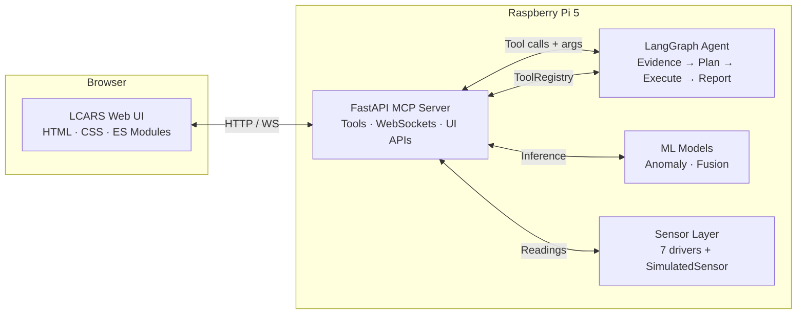
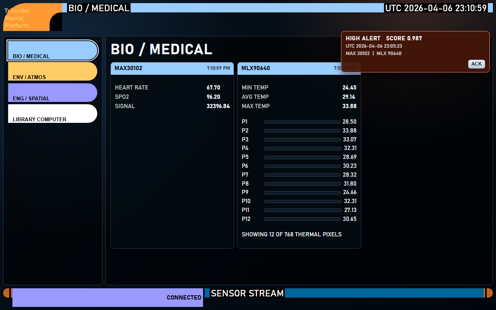
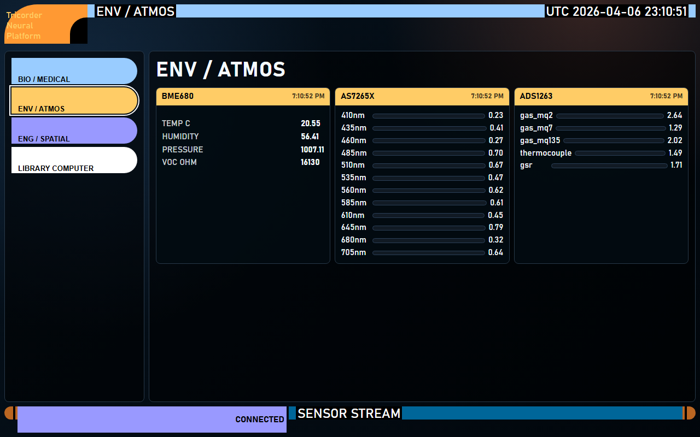
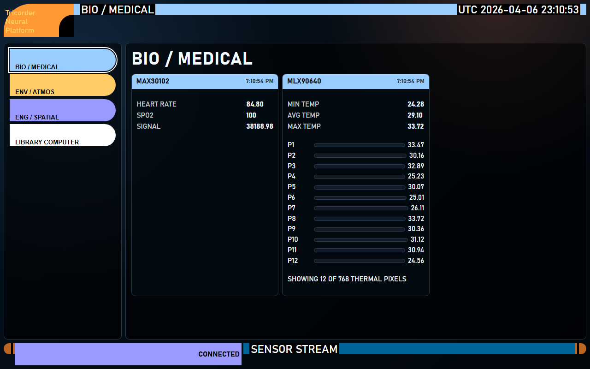
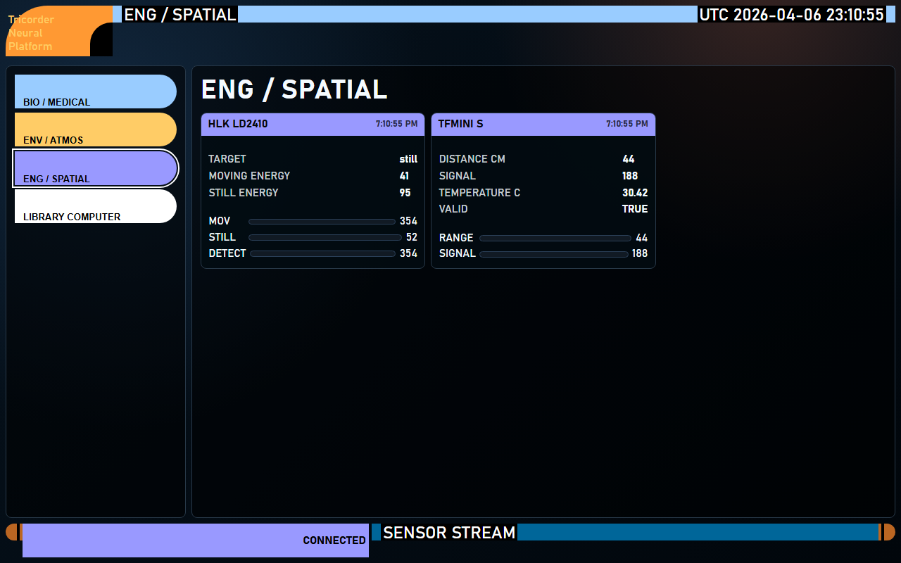
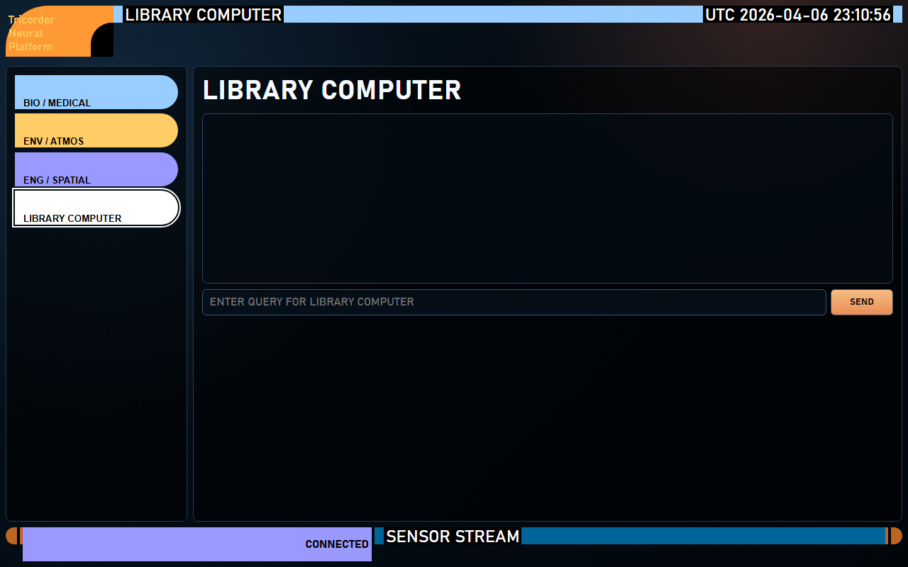

# Tricorder Neural Network Platform

Edge AI sensor fusion system on Raspberry Pi 5 + Hailo-10H with LangGraph ReAct agent.

[](https://github.com/ianshank/Raspberry-Pi-Tricorder-/actions/workflows/ci.yml)

## Architecture

- **Sensors**: 10-channel ADC (ADS1263) + I2C (BME680, MLX90640, AS7265x, MAX30102) + UART (HLK-LD2410 radar, TFMini-S LiDAR)
- **Neural Networks**: Anomaly detector (autoencoder-LSTM), sensor fusion transformer — designed for Hailo-10H NPU
- **Agent**: LangGraph ReAct agent with `planned_steps` arg-passing for autonomous, multi-sensor evidence gathering
- **MCP Server**: FastAPI server exposing all sensors and models as callable tools; bootstraps 7 default tools on startup
- **UI**: LCARS-inspired static dashboard with live sensor/anomaly streams, markdown agent chat, and WCAG 2.1 focus indicators
- **Configuration**: Pydantic-based, YAML-driven, env-var overrideable — zero hardcoded values

Full C4 architecture: [`docs/architecture/c4-architecture.md`](docs/architecture/c4-architecture.md)

## C2 Architecture Overview



## Quick Start

```bash
pip install -e ".[dev]"
pytest tests/ -v
```

Start the server (hardware-free, simulated sensors):

```bash
PYTHONPATH=src python -m uvicorn mcp_server.server:app --reload
# or
make run
```

Open `http://127.0.0.1:8000/ui/index.html`

## Screenshots

> **No hardware required** — run with simulated sensors (see Quick Start above).  
> Screenshot files live in [`docs/screenshots/`](docs/screenshots/CAPTURING.md). Add your own by following the capture guide there.

| Dashboard — LCARS live view | Anomaly alert + ACK |
|---|---|
|  |  |

| Environmental panel | Biosigns panel |
|---|---|
|  |  |

| Engineering panel | Agent inference report |
|---|---|
|  |  |

## Project Structure

```text
src/
  sensors/       # Hardware-abstracted sensor drivers (I2C/SPI/UART) + SimulatedSensor
  models/        # Neural network wrappers (anomaly detection, fusion)
  agents/        # LangGraph ReAct agent (evidence gather, plan, execute, synthesize)
  mcp_server/    # FastAPI MCP tool server (ToolRegistry, WS streams, auth, 404 handler)
  utils/         # Configuration (Pydantic) and structured logging
tests/
  unit/          # Unit tests (mocked hardware, all 452 pass)
  integration/   # Component integration tests
  e2e/           # End-to-end pipeline tests
  regression/    # Backwards compatibility tests
  sanity/        # Smoke tests and import validation
config/
  base.yaml      # Default configuration
docs/
  architecture/  # C4 architecture model (c4-architecture.md)
```

## Documentation

- C4 architecture: [`docs/architecture/c4-architecture.md`](docs/architecture/c4-architecture.md)
- Changelog: [`CHANGELOG.md`](CHANGELOG.md)

## Configuration

All values in `config/base.yaml`. Override via environment variables:

```bash
export TRICORDER_LOGGING_LEVEL=DEBUG
```

### UI Endpoints

| Endpoint | Method | Description |
|---|---|---|
| `/ui/index.html` | GET | Static LCARS dashboard |
| `/ui/config.json` | GET | Runtime-safe UI configuration |
| `/ws/sensors` | WS | Live sensor readings stream |
| `/ws/anomalies` | WS | Live anomaly stream |
| `/ui/agent/chat` | POST | Agent chat (query + sensor context) |
| `/ui/anomalies/ack` | POST | Acknowledge anomaly by ID |
| `/ui/anomalies/ack` | GET | Endpoint description |
| `/ui/*` (miss) | — | LCARS-branded HTML 404 |

### Anomaly Acknowledgment

Config keys:

| Key | Default | Description |
|---|---|---|
| `ui.anomaly_ack_enabled` | `true` | Enable/disable ack endpoint |
| `ui.anomaly_ack_path` | `/ui/anomalies/ack` | HTTP path |
| `ui.anomaly_ack_history_limit` | `500` | In-memory retention cap |

Example request:

```json
{
  "anomaly_id": "anom-1234567890abcdef",
  "acknowledged_by": "ui",
  "note": "Operator acknowledged"
}
```

## Testing

```bash
pytest tests/ -v                                    # All tests
pytest tests/ -v --cov=src --cov-fail-under=85      # With coverage gate (94% achieved)
pytest tests/unit/ -v                               # Unit only
```

All tests use mocked I/O adapters — no hardware required. The simulated sensor layer
(`_SimulatedSensor`) provides realistic randomised readings for hardware-free development.

### Quality Gates

| Gate | Tool | Status |
|---|---|---|
| Lint | `ruff check src tests` | ✅ Clean |
| Types | `mypy --config-file mypy.ini src tests` | ✅ Clean |
| Tests | `pytest --cov-fail-under=85` | ✅ 452 passed, 94.30% coverage |
| Security | `bandit -r src/ -ll` | ✅ 0 High, 0 Medium |

## Next Steps

### Near-Term (highest priority)

1. **Persistent anomaly acknowledgment state**: move ACK tracking from in-memory dict to SQLite
   so state survives service restarts and multiple operator sessions.
2. **Agent LLM integration**: connect `TricorderAgent` to a real Ollama / Hailo-backed LLM
   endpoint so `synthesize_report_node` generates contextual text rather than template output.
3. **Operator identity propagation**: pass authenticated operator identity through anomaly
   acknowledgment records for a full operator audit trail.

### Medium-Term

4. **UI anomaly history panel**: surface acknowledged anomaly history with filtering and export
   for operator audit and post-incident review.
5. **Hardware CI runner**: add a Raspberry Pi self-hosted GitHub Actions runner so the full
   sensor driver suite is exercised in CI against real hardware.
6. **Hailo-10H model deployment runbook**: document the HEF compilation, runtime setup, and
   model hot-swap workflow for production Hailo NPU integration.
7. **Persistent chat context**: extend agent sessionStorage persistence to server-side session
   storage so multi-device operator contexts can be shared.

### Long-Term

8. **Multi-node federation**: support multiple Tricorder Pi nodes reporting to a central
   aggregation service with fleet-level anomaly correlation.
9. **Over-the-air configuration**: dynamic config reload endpoint (`PUT /admin/config`) with
   HMAC-authenticated updates so field deployments can be reconfigured without restart.
10. **Streaming agent inference**: replace request/response agent chat with a Server-Sent
    Events stream so operators see token-by-token agent reasoning in the LCARS panel.

## Developed by

Ian Cruickshank
