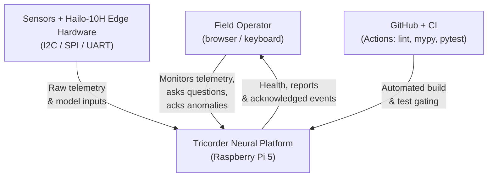
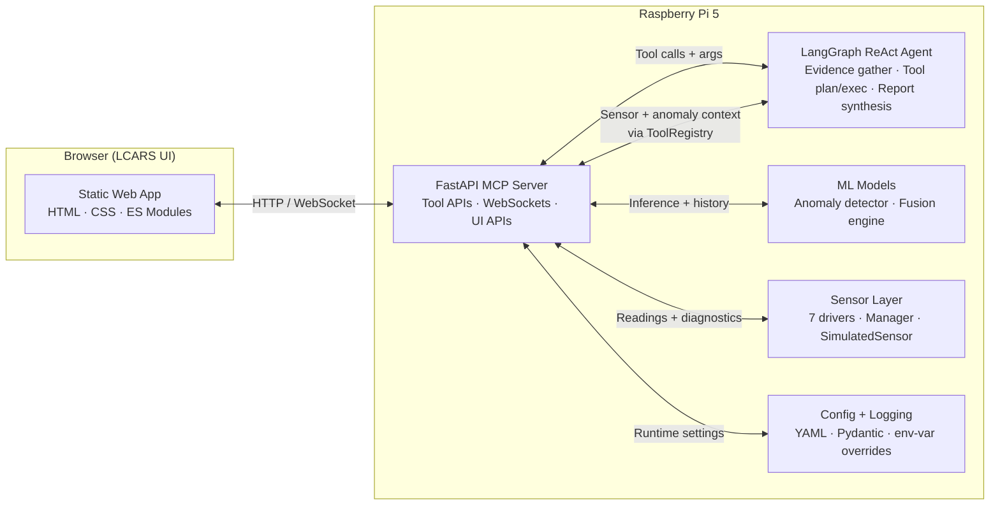
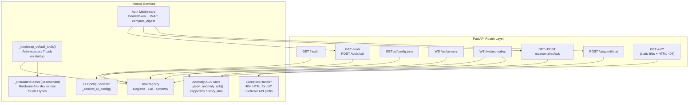
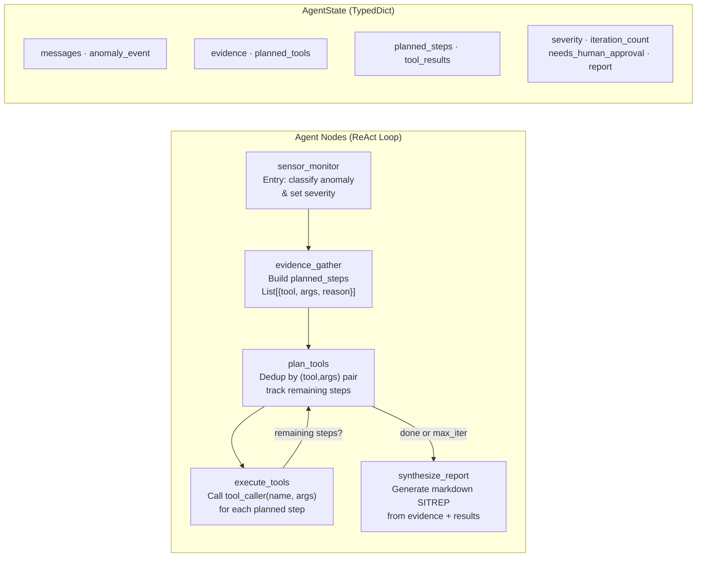

# C4 Architecture - Tricorder Neural Platform

This document captures the C4 model views for the Raspberry Pi Tricorder application.
Last updated: 2026-04-06

---

## C1 - System Context

### Context Notes

- Primary user is a field operator using the LCARS web UI for telemetry monitoring and anomaly triage.
- Seven physical sensor types feed data through hardware-abstracted Python drivers.
- Neural models perform anomaly detection and multi-sensor fusion on the Hailo-10H NPU.
- The MCP server is the single integration backbone for tools, streaming, chat, and static UI.
- CI gates ruff (lint), mypy (types), and pytest (coverage ≥ 85%) on every push and PR.

---

## C2 - Container View

### Container Responsibilities

| Container | Responsibility |
|---|---|
| **Web UI** | Panelised LCARS telemetry; agent chat; anomaly ack workflow; markdown rendering |
| **MCP Server** | Integration backbone: ToolRegistry, WS streams, auth, anomaly tracking, 404/error handling |
| **LangGraph Agent** | `evidence_gather → plan_tools → execute_tools → synthesize_report` ReAct loop with per-tool args |
| **ML Models** | Autoencoder-LSTM anomaly detector; sensor fusion transformer (Hailo-10H targets) |
| **Sensor Layer** | Hardware-abstracted drivers + `_SimulatedSensor` for hardware-free development |
| **Config** | Pydantic-validated YAML config; zero hardcoded values; env-var overrides |

---

## C3 - Component View (MCP Server)

### Component Notes

- `ToolRegistry` encapsulates callable MCP tool functions, schemas, and sync/async dispatch.
- `_bootstrap_default_tools()` auto-registers all 7 sensor tools when no registry is injected,
  enabling the full UI and agent without hardware.
- `_SimulatedSensor(BaseSensor)` provides realistic randomised readings for all 7 sensor types
  so the complete sensor/anomaly/agent pipeline exercises without physical hardware.
- UI config sanitizer publishes safe runtime config; strips server-side secrets before sending.
- Auth middleware fails closed when auth is enabled but no API key is configured (HTTP 503).
- 404 handler returns LCARS-branded HTML for `/ui/*` paths and preserves `detail` on API paths.

---

## C3b - Component View (LangGraph Agent)

### Key Design Decisions

- `planned_steps: List[Dict]` carries `{tool, args}` pairs through the cycle; `planned_tools` retains the name-only list for backward compatibility with tests that check membership.
- Deduplication in `plan_tools_node` hashes `(tool_name, frozenset(args.items()))` so multiple `read_sensor` calls for different `sensor_id` values all execute independently.
- `synthesize_report_node` emits GitHub-flavoured markdown; the chat panel renders it via `renderMarkdown()`.

---

## C4 - Code View Anchors

| Concern | Entry Point |
|---|---|
| Server bootstrap & routing | `src/mcp_server/server.py` → `create_app()` |
| Tool registration | `src/mcp_server/server.py` → `_bootstrap_default_tools()` |
| Simulated hardware | `src/mcp_server/server.py` → `_SimulatedSensor` |
| Agent ReAct loop | `src/agents/langgraph_agent.py` → `TricorderAgent` |
| UI live data | `src/ui/static/js/services/data-service.js` → `DataService` |
| Anomaly alert rendering | `src/ui/static/js/components/anomaly-alert-stack.js` |
| Environmental telemetry | `src/ui/static/js/components/env-panel.js` |
| Biomedical + thermal | `src/ui/static/js/components/bio-panel.js` |
| Engineering / radar | `src/ui/static/js/components/eng-panel.js` |
| Markdown chat rendering | `src/ui/static/js/components/agent-chat-panel.js` |
| Pydantic configuration | `src/utils/config.py` |
| Anomaly detection model | `src/models/anomaly_detector.py` |
| Sensor driver base | `src/sensors/base.py` → `BaseSensor` |

---

## Roadmap Reference

Operational roadmap items are maintained in `README.md` under the **Next Steps** section.
