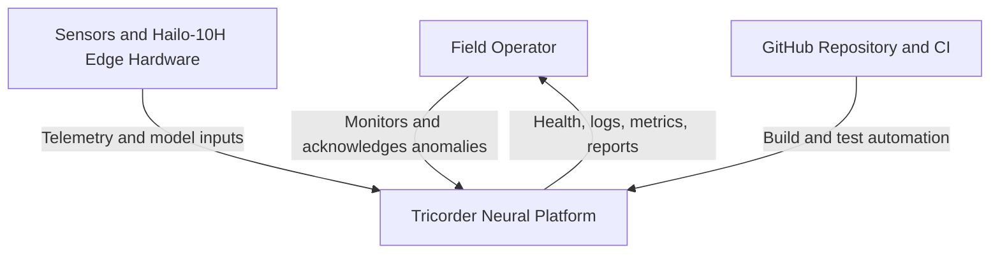
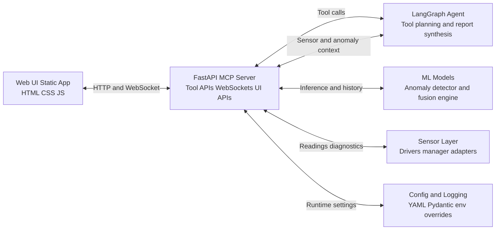
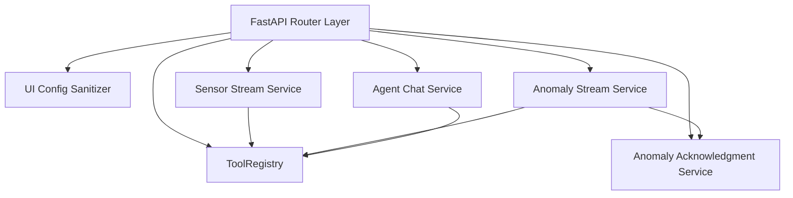

# C4 Architecture - Tricorder Neural Platform

This document captures the C4 model views for the Raspberry Pi Tricorder application.

## C1 - System Context

### Context Notes

- Primary user is a field operator using the web UI for telemetry and anomaly triage.
- Sensor drivers collect data from I2C, SPI, and UART hardware on Raspberry Pi.
- Neural models perform anomaly detection and sensor fusion.
- The MCP server exposes tool and UI endpoints for internal and operator workflows.

## C2 - Container View

### Container Responsibilities

- Web UI renders panelized telemetry and anomaly workflows.
- MCP server is the integration backbone for tools, streaming, and UI APIs.
- LangGraph agent supports guided analysis and operator responses.
- Models convert incoming telemetry into anomaly and fusion insights.
- Sensor layer abstracts hardware interfaces and fault handling.

## C3 - Component View (MCP Server)

### Component Notes

- ToolRegistry encapsulates callable MCP tool functions and schemas.
- UI config sanitizer publishes safe runtime config to frontend clients.
- Sensor and anomaly stream services provide near-real-time telemetry.
- Acknowledgment service tracks operator decisions against anomaly IDs.
- Agent chat service orchestrates request context and response generation.

## C4 - Code View Anchors

Key module anchors for implementation mapping:

- src/mcp_server/server.py
- src/utils/config.py
- src/ui/static/js/services/data-service.js
- src/ui/static/js/components/anomaly-alert-stack.js
- src/agents/langgraph_agent.py
- src/models/anomaly_detector.py
- src/sensors/manager.py

## Roadmap Reference

Operational roadmap items are maintained in `README.md` under the Next Steps section.
